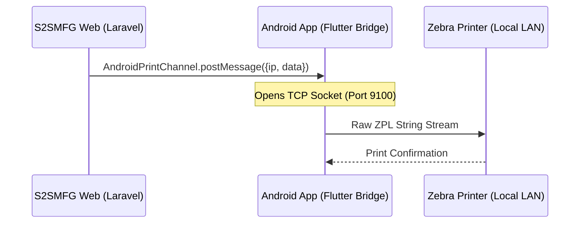

<div align="center">
  <h1>🏭 S2SMFG WebView & Print Bridge</h1>
  <p><strong>A specialized Android wrapper connecting cloud-based manufacturing systems directly to local industrial printers.</strong></p>

  [](https://flutter.dev)
  [](https://dart.dev)
  [](https://android.com)
  [](https://opensource.org/licenses/MIT)
</div>

<br/>

## 📖 Overview

The **S2SMFG WebView App** is an Android-based thin client designed specifically for factory floor operations. It wraps the [S2SMFG Production Portal](https://s2smfg.biz.id/manufacturing/inject) in a full-screen kiosk-like experience while providing a critical hardware capability: a **JavaScript-to-TCP Bridge**.

This bridge allows the cloud-based web application to bypass standard browser print dialogues and stream raw **ZPL (Zebra Programming Language)** commands directly to thermal printers on the local factory network (LAN) with zero latency.

## 🏗️ Architecture

By acting as a localized proxy, the application eliminates the need for complex VPNs or print servers:



## ✨ Core Features

* **🌐 Immersive WebView**: Full-screen, distraction-free environment locked to the production URL, complete with dynamic loading indicators.
* **🖨️ Direct TCP Print Bridge**: A custom JavaScript interface (`AndroidPrintChannel`) that translates web-triggered events into direct socket connections to Zebra printers (Port 9100).
* **📷 Hardware Integration**: Seamlessly requests and manages Android camera permissions for in-app QR/Barcode scanning via the web application.
* **⚙️ Dynamic Configuration**: An accessible settings menu allowing on-site technicians to remap the target VPS/Server URL without reinstalling the application.

## 🛠️ Tech Stack

- **Framework**: Flutter SDK (≥ 3.12.2)
- **Language**: Dart
- **Engine Plugins**:
  - `webview_flutter` (^4.8.0) - High-performance web rendering.
  - `permission_handler` (^11.3.1) - Native hardware permission routing.

## 🚀 Getting Started

### Prerequisites
- Flutter SDK installed and configured.
- Android Studio / Android SDK (Targeting minSdk 21+).
- A device connected to the factory LAN (for printing capabilities).

### Installation & Build

1. **Clone the repository**
   ```bash
   git clone https://github.com/IT-MadaWikriPSG/Webview-S2SMFG.git
   cd flutter-webview-s2smfg
   ```

2. **Fetch Dependencies**
   ```bash
   flutter pub get
   ```

3. **Build the Application**
   ```bash
   # Build a debug APK for testing
   flutter build apk --debug

   # Build a release APK for production deployment
   flutter build apk --release
   ```
   *The output will be located at `build/app/outputs/flutter-apk/app-release.apk`.*

## 🔌 Implementation Guide (Web Side)

To trigger a print job from the S2SMFG web application, the frontend must emit a JSON payload to the injected Android interface:

```javascript
// Example Laravel Blade / JS Implementation
if (window.AndroidPrintChannel) {
    window.AndroidPrintChannel.postMessage(JSON.stringify({
        ip: "192.168.1.100", // Target printer IP on local LAN
        data: "^XA^FO50,50^ADN,36,20^FDHello Factory!^FS^XZ" // Raw ZPL payload
    }));
} else {
    console.warn("Print Bridge not detected. Are you in the Android App?");
}
```

## 🔗 Related Ecosystem

This application is part of the broader S2SMFG ecosystem:
- **Core Platform**: [ardyansyahp/s2smfg](https://github.com/ardyansyahp/s2smfg) (Laravel Backend)
- **Logistics App**: [ardyansyahp/flutter-driverapp-s2smfg](https://github.com/ardyansyahp/flutter-driverapp-s2smfg)

---
<div align="center">
  <sub>Built with ❤️ by the IT Mada Wikri Engineering Team.</sub>
</div>
